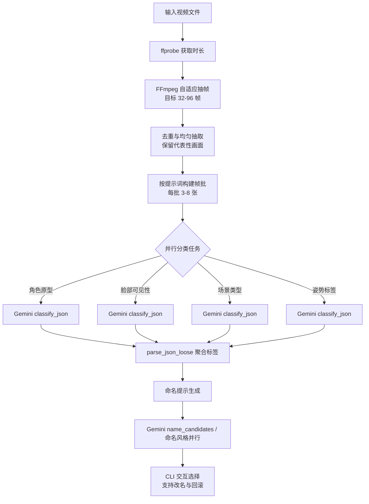

# VideoRenamer

基于 Gemini 多模态的成人视频自动重命名工具。

## 🚀 快速开始

```powershell
# 1. 创建虚拟环境
python -m venv .venv
.\.venv\Scripts\Activate.ps1

# 2. 安装依赖
pip install httpx python-dotenv pydantic pydantic-settings typer rich

# 3. 配置环境
copy .env.example .env
notepad .env

# 4. 运行测试
.\.venv\Scripts\python.exe -m vrenamer.cli.main run "X:\Videos\test.mp4"
```

**详细安装指南**: [docs/setup.md](docs/setup.md)

## 📚 文档导航

| 文档类型 | 文档名称 | 说明 |
|---------|---------|------|
| **核心文档** | [核心需求.md](核心需求.md) | 详细需求、技术约束、命名规范 |
| **用户文档** | [环境搭建](docs/setup.md) | 虚拟环境、依赖安装、故障排查 |
| | [CLI 使用](docs/cli.md) | 命令详解、参数说明、工作流程 |
| | [GPT-Load 接口](docs/gptload-api.md) | API 接口对比和配置说明 |
| **开发文档** | [开发路线图](docs/NEXT_STEPS.md) | 当前状态、优先级、技术选型 |
| | [技术决策](docs/decisions.md) | 架构选型、接口决策、实现原理 |
| **协作规范** | [AGENTS.md](AGENTS.md) | AI Agent 协作准则、代码规范 |

完整文档索引: [docs/README.md](docs/README.md)

## 🧠 单视频分析流程



## 📄 许可证

本项目仅供个人学习和研究使用。
