# VideoRenamer

基于 Gemini 多模态的成人视频自动重命名工具。

## 🚀 快速开始

```powershell
# 1. 创建虚拟环境
python -m venv .venv
.\.venv\Scripts\Activate.ps1

# 2. 安装依赖
pip install httpx python-dotenv pydantic pydantic-settings typer rich

# 3. 配置环境
copy .env.example .env
notepad .env

# 4. 试跑单视频流程（推荐先 --dry-run；默认真实调用）
.\.venv\Scripts\python.exe -m vrenamer.cli.main run "X:\Videos\test.mp4" --dry-run --non-interactive

# 如需真实调用（会产生真实 LLM 请求）：
.\.venv\Scripts\python.exe -m vrenamer.cli.main run "X:\Videos\test.mp4" --non-interactive

# 5. 执行回归测试（涵盖管线与风格生成）
.\.venv\Scripts\python.exe -m pytest -q
```

**详细安装指南**: [docs/setup.md](docs/setup.md)

## 📚 文档导航

| 文档类型     | 文档名称                             | 说明                         |
| ------------ | ------------------------------------ | ---------------------------- |
| **核心文档** | [核心需求.md](核心需求.md)           | 详细需求、技术约束、命名规范 |
| **用户文档** | [环境搭建](docs/setup.md)            | 虚拟环境、依赖安装、故障排查 |
|              | [CLI 使用](docs/cli.md)              | 命令详解、参数说明、工作流程 |
|              | [GPT-Load 接口](docs/gptload-api.md) | API 接口对比和配置说明       |
| **开发文档** | [开发路线图](docs/NEXT_STEPS.md)     | 当前状态、优先级、技术选型   |
|              | [技术决策](docs/decisions.md)        | 架构选型、接口决策、实现原理 |
| **测试文档** | [测试指南](docs/testing-guide.md)    | 自动化与手工测试清单         |
| **协作规范** | [AGENTS.md](AGENTS.md)               | AI Agent 协作准则、代码规范  |

完整文档索引: [docs/README.md](docs/README.md)

## 🏗️ 系统架构

```mermaid
graph TB
    subgraph CLI层 ["CLI 层 (interactive.py)"]
        A[InteractiveCLI.run] --> B[VideoScanner.scan]
        B --> C{用户选择}
        C -->|AI命名| D[_ai_rename]
        C -->|手动命名| E[_manual_rename]
        D --> F[Pipeline 服务]
    end

    subgraph Pipeline ["Pipeline 服务层 (pipeline.py)"]
        F --> G[sample_frames<br/>异步 ffmpeg 缓存]
        G --> H[analyze_tasks<br/>批次复用 + 利用率统计]
        H --> I[generate_names_with_styles]
    end

    subgraph Generator ["命名生成器 (generator.py)"]
        I --> J[NamingGenerator]
        J --> K[风格配置校验]
        K --> L[构造 System/User Prompt]
        L --> M[GeminiLLMAdapter<br/>统一 LLM 接口]
        M --> N[JSON/列表/纯文本 Fallback]
    end

    subgraph Output ["输出与反馈"]
        N --> O[sanitize_filename]
        O --> P[CLI 交互选择]
        E --> P
        P --> Q[os.rename 应用]
        Q --> R[统计处理/跳过数]
    end

    style CLI层 fill:#e1f5ff
    style Pipeline fill:#fff3e0
    style Generator fill:#f3e5f5
    style Output fill:#e8f5e9
```

## 🧠 单视频分析流程

```mermaid
flowchart TD
    A[输入视频文件] --> B[异步 ffprobe<br/>_probe_duration]
    B --> C[FFmpeg 自适应抽帧<br/>目标 ≤96 帧]
    C --> D[去重 + 均匀采样]
    D --> E[按任务键分配帧<br/>批次复用]
    E --> F{并行分类任务<br/>Semaphore 限流}
    F -->|角色原型| G1[Gemini classify_json]
    F -->|脸部可见性| G2[Gemini classify_json]
    F -->|场景类型| G3[Gemini classify_json]
    F -->|姿势标签| G4[Gemini classify_json]
    G1 --> H[parse_json_loose 宽松解析]
    G2 --> H
    G3 --> H
    G4 --> H
    H --> I[聚合标签结果 + 利用率指标]
    I --> J[NamingGenerator<br/>GeminiLLMAdapter]
    J --> K{每风格 LLM 调用}
    K --> L1[风格1: 候选 n 个]
    K --> L2[风格2: 候选 n 个]
    K --> L3[风格3: 候选 n 个]
    L1 --> M[合并候选列表]
    L2 --> M
    L3 --> M
    M --> N[sanitize_filename 清理非法字符]
    N --> O[CLI 交互选择<br/>progress_callback 反馈]
    O --> P[os.rename 重命名]
    P --> Q[更新统计信息]

    style E fill:#fff3e0
    style F fill:#ffebee
    style J fill:#f3e5f5
    style O fill:#e8f5e9
```



## 🔄 并发控制机制

```mermaid
sequenceDiagram
    participant CLI as InteractiveCLI
    participant Pipeline as Pipeline Service
    participant Sem as Semaphore(max_concurrency)
    participant Gemini as Gemini API

    CLI->>Pipeline: analyze_tasks(task_prompts)

    loop 任务批次
        Pipeline->>Sem: acquire()
        Sem-->>Pipeline: permit
        Pipeline->>Gemini: classify_json(frame_chunk, prompt)
        Gemini-->>Pipeline: JSON 响应
        Pipeline->>Pipeline: parse_json_loose()
        Pipeline->>Sem: release()
    end

    Pipeline-->>CLI: 聚合标签 + 利用率

    CLI->>Pipeline: generate_names_with_styles()

    loop 各风格
        Pipeline->>Gemini: name_candidates(system_prompt, user_prompt)
        Gemini-->>Pipeline: JSON/文本响应
    end

    Pipeline-->>CLI: 风格候选表格
    CLI->>CLI: 用户选择 / os.rename()
```



## 📄 许可证

本项目仅供个人学习和研究使用。
