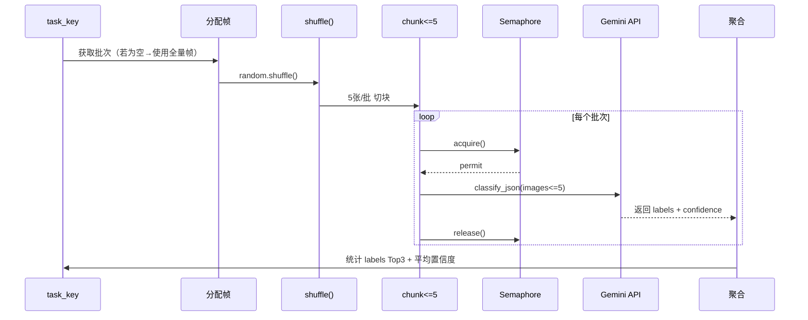

# 视频分析并发策略详解

**文档版本**: v1.1  
**最后更新**: 2025-10-24  
**目的**: 说明最新的帧分配与并发策略，指导开发者与 AI Agent 正确扩展或调优。

---

## 📊 当前实现概览

- **帧准备**：`sample_frames` 异步调用 ffprobe / ffmpeg，最多保留 96 帧并完成去重。
- **帧分配**：`_build_frame_batches` 按任务键分配帧，目标范围 `min_batch=15` / `max_batch=20`。
- **小样本回退**：若总帧数不足 `min_batch * 任务数`，改为轮询分配，确保不会产生空批次。
- **任务执行**：`analyze_tasks` 对分配结果逐任务洗牌 → 切块（每批 ≤5 帧）→ 受 `Semaphore` 控制并发调用。
- **统计指标**：每个任务都会输出 `total_frames_available`、`total_frames_used`、`total_calls`，便于审计利用率。
- **测试保障**：`tests/test_pipeline.py` 覆盖了批次复用与 JSON 回退，运行 `pytest -q` 可快速验证。

---

## 🧮 帧分配策略

### 步骤 1：基础信息

```
frames = 去重 + 均匀采样后的帧列表
keys   = task_prompts.keys()  # 例如 role/face/scene/positions
min_batch = 15
max_batch = 20
```

### 步骤 2：首尾保护 + 随机化

```python
if len(frames) >= 2:
    shuffled = [frames[0]] + random.shuffle(frames[1:-1]) + [frames[-1]]
else:
    shuffled = frames.copy()
```

### 步骤 3：小样本回退

```python
if total_frames < min_batch * num_tasks:
    # 轮询分配：frame0 -> task0, frame1 -> task1, ...
```

### 步骤 4：常规分配

```python
target_per_task = clamp(total_frames // num_tasks, min_batch, max_batch)
batch = shuffled[start_idx:start_idx + target_per_task]
if len(batch) < min_batch:
    batch = _evenly_sample(shuffled, min_batch)
```

> **结果**：`Dict[str, List[Path]]`，每个任务拿到约 15~20 帧，且首尾帧会至少被一个任务使用。

---

## 🧵 单任务执行流程



- `frames_used` 统计每个任务真实上传的帧数，可与分配结果做差。
- 当 `batch` 原本为空（例如扫描结果中没有可用帧），逻辑会回落到全量帧，以保证鲁棒性。

---

## 💡 日志与可观测性

典型日志片段（来自 `pipeline.py`）：

```
[INFO] 角色标签: 使用 18 帧进行分批分析
[INFO] 角色标签: 打乱后分成 4 批，每批 ≤ 5 帧
[INFO] 角色标签: 总计将使用 18 帧（覆盖率 18/18）
[SUCCESS] 角色标签: 汇总 4 次调用 → ['人妻', '熟女'] (置信度: 0.87)
```

**建议监控字段**：
- `len(batch)`：检测某任务被分配帧数是否异常（过小或过大）。
- `frames_used` 与 `len(batch)`：判断帧复用率。
- `avg_confidence`：衡量标签稳定性。

---

## 🔧 可调节参数

| 参数 | 位置 | 说明 | 建议范围 |
|------|------|------|---------|
| `min_batch` / `max_batch` | `pipeline._build_frame_batches` | 控制每任务帧数上下限 | 10~25 |
| `IMAGES_PER_CALL` | `analyze_tasks` | 单次 Gemini 调用的图片数量 | 3~5 |
| `settings.max_concurrency` | `.env` / `Settings` | 全局并发上限 | 16~64 |
| `_decide_sampling_fps` | `pipeline.py` | 控制抽帧密度 | 按视频长度调节 |

> 调整任何参数后必须执行 `pytest -q`，确保 `tests/test_pipeline.py` 中的利用率与解析逻辑仍然成立。

---

## 🧪 如何验证

1. **自动化**：`.\.venv\Scripts\python.exe -m pytest -q`
   - `test_analyze_tasks_respects_batches` 会检查帧批次与 API 调用次数是否一致。
   - `test_generate_names_json_fallback` 验证 JSON 嵌套解析回退逻辑。
2. **手动**：运行 dry-run，观察日志是否输出 `总计将使用 X 帧（覆盖率 ...）`，并确保覆盖率合理（50% 以下需排查）。

---

## 📚 关联文档

- [docs/cli.md](cli.md)：终端工作流程与故障排查。
- [docs/testing-guide.md](testing-guide.md)：回归测试清单。
- [docs/decisions.md](decisions.md)：关键架构决策记录。

---

## 🔖 版本历史

| 版本 | 日期 | 说明 |
|------|------|------|
| v1.1 | 2025-10-24 | 更新为“任务分配 + 小样本回退 + 帧复用”策略，补充测试与调优建议 |
| v1.0 | 2025-01-24 | 初版，描述“每任务全量帧 + 16 批”方案 |
