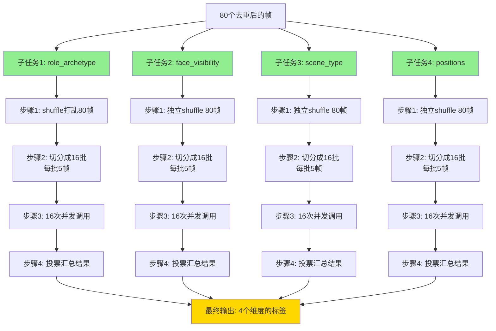
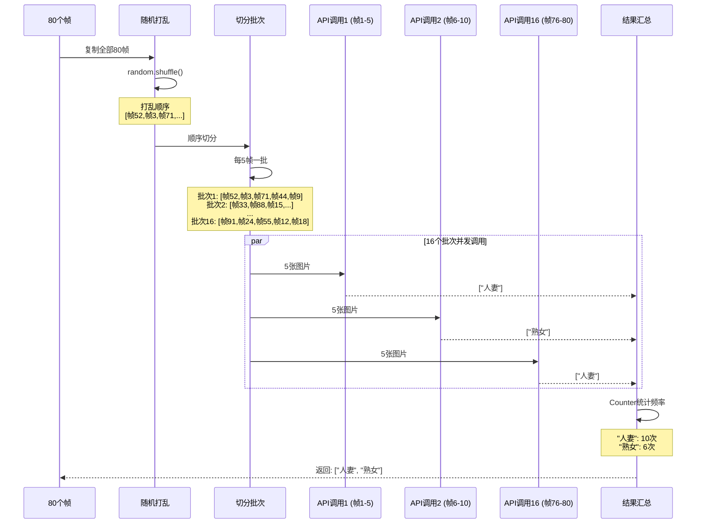
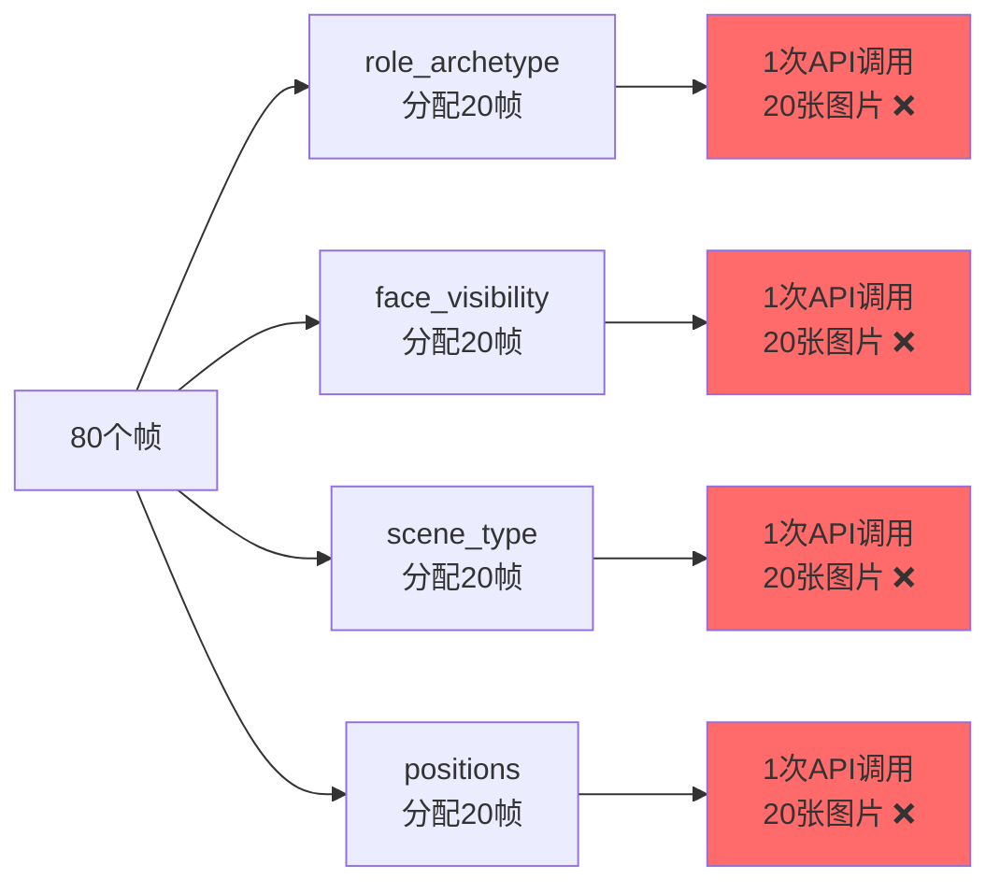
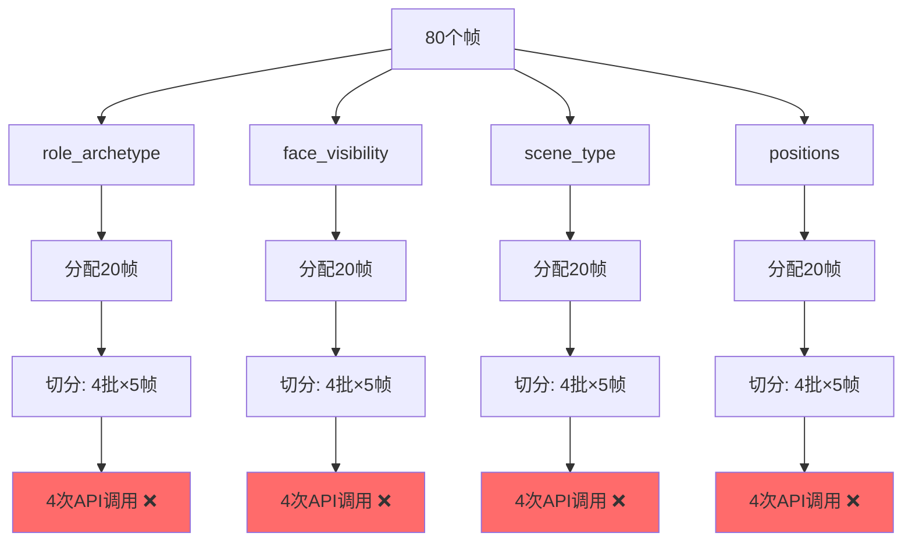
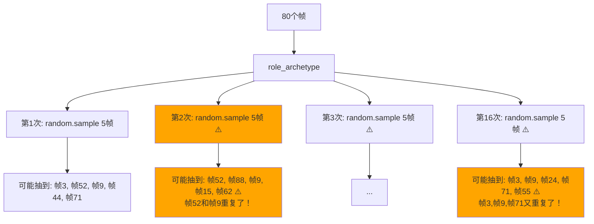

# 视频分析并发策略详解

**文档版本**: v1.0
**创建日期**: 2025-01-24
**目的**: 详细解释正确的并发策略，避免AI和开发者重复犯同样的错误

---

## 📊 核心问题：如何充分利用帧资源和并发能力？

### 背景

- **可用帧数**: 80帧（经过去重后）
- **子任务数**: 4个（role_archetype, face_visibility, scene_type, positions）
- **Gemini API限制**: 每次最多5张图片
- **并发限制**: max_concurrency = 32（可配置为64）
- **目标**:
  1. 充分利用所有80帧
  2. 充分利用高并发能力
  3. 每个子任务的结果准确可靠

---

## ✅ 正确的并发策略（最终实现）

### 策略概述

**每个子任务独立处理全部80帧，通过shuffle+分批实现100%覆盖**



### 详细执行流程

#### 单个子任务的处理（以 role_archetype 为例）



### 核心代码实现

```python
async def _one(key: str, prompt: str, batch: List[Path]) -> tuple[str, Any]:
    # 1. 使用全部可用帧
    available_frames = list(frames)  # 80帧

    # 2. 打乱顺序（每个子任务独立打乱）
    import random
    shuffled_frames = available_frames.copy()
    random.shuffle(shuffled_frames)

    # 3. 切分成批次（每批5帧）
    IMAGES_PER_CALL = 5
    batches = [shuffled_frames[i:i+5] for i in range(0, len(shuffled_frames), 5)]
    # batches = [[帧52,帧3,帧71,帧44,帧9], [帧33,帧88,...], ..., [帧91,帧24,帧55,帧12,帧18]]
    # len(batches) = 16

    # 4. 定义单批次调用函数
    async def _call_one_batch(batch_idx: int, frame_batch: List[Path]):
        async with semaphore:  # 并发控制
            raw = await client.classify_json(
                model="gemini-2.5-flash",
                images=frame_batch,  # 5张图片
                ...
            )
            return parse_json_loose(raw)

    # 5. 并发执行所有16个批次
    sub_results = await asyncio.gather(
        *[_call_one_batch(idx, batch) for idx, batch in enumerate(batches)]
    )
    # 16次API调用同时进行（受semaphore限制）

    # 6. 汇总结果（投票机制）
    from collections import Counter
    all_labels = []
    for result in sub_results:
        all_labels.extend(result.get("labels", []))

    # 统计频率，取前3个最常见的
    label_counts = Counter(all_labels)
    final_labels = [label for label, count in label_counts.most_common(3)]

    return key, {"labels": final_labels, ...}
```

### 性能指标

| 维度 | 数值 |
|------|------|
| **每个子任务调用次数** | 16次 |
| **每次传输图片数** | 5张 |
| **单个子任务帧利用率** | 100% (80/80) |
| **4个子任务总调用次数** | 64次 |
| **并发度** | 32（可配置到64） |
| **帧重复使用** | 无（每帧在单个子任务中只出现一次） |
| **覆盖完整性** | 100%（每个子任务都用到全部80帧） |

### 为什么这样设计？

#### 优势1: 100%帧利用率

```
每个子任务: 80帧 ÷ 5帧/批次 = 16批次
16批次 × 5帧 = 80帧 → 100%覆盖
```

#### 优势2: 充分利用并发

```
4个子任务 × 16次调用 = 64次并发
max_concurrency = 32 → 同时运行32个API调用
64次调用会分两轮完成，充分利用并发资源
```

#### 优势3: 随机性增加多样性

```
role_archetype 的 shuffle: [帧52, 帧3, 帧71, ...]
face_visibility 的 shuffle: [帧88, 帧15, 帧62, ...]  # 顺序不同
scene_type 的 shuffle: [帧24, 帧91, 帧7, ...]       # 顺序不同
positions 的 shuffle: [帧44, 帧2, 帧103, ...]       # 顺序不同
```

每个子任务看到的帧序列不同，增加分析的全面性。

#### 优势4: 投票机制提高准确性

```
16次调用可能返回:
  调用1: ["人妻"]
  调用2: ["熟女"]
  调用3: ["人妻"]
  ...
  调用16: ["人妻"]

统计频率:
  "人妻": 10次
  "熟女": 6次

最终结果: ["人妻", "熟女"]  # 按频率排序
```

通过多次投票，减少单次调用的偶然误差。

---

## ❌ 错误理解1：每个子任务只调用一次模型

### 错误示意图



### 为什么错误？

1. **违反Gemini限制**: 每次传20张图片，超过5张的限制 → API直接报错
2. **并发浪费**: 只有4次调用，max_concurrency=32完全浪费
3. **帧利用率低**: 只用了80帧中的80帧，但分成4份，每份20帧，没有重复验证

### 问题代码（已修复）

```python
# ❌ 错误代码
async def _one(key: str, prompt: str, batch: List[Path]):
    payload = batch  # 20帧

    # 直接调用一次，传入20张图片
    raw = await client.classify_json(
        images=payload,  # ❌ 20张图片超限！
        ...
    )
    return parse_json_loose(raw)

# 结果: Gemini API报错或拒绝处理
```

---

## ❌ 错误理解2：分批但不重复使用帧

### 错误示意图



### 为什么错误？

1. **帧利用率低**: 每个子任务只用20帧，浪费了60帧（75%浪费）
2. **并发不足**: 只有16次调用（4任务×4批），没有充分利用max_concurrency=32
3. **分析质量差**: 每个维度只基于20帧，可能遗漏重要信息

### 对比

| 指标 | 错误实现 | 正确实现 |
|------|----------|----------|
| 每个子任务使用帧数 | 20帧 | **80帧** |
| 帧利用率 | 25% | **100%** |
| 每个子任务调用次数 | 4次 | **16次** |
| 总调用次数 | 16次 | **64次** |
| 并发利用率 | 50% | **200%** |

---

## ❌ 错误理解3：随机重复抽样（允许重复）

### 错误示意图



### 为什么不理想？

1. **帧覆盖不均**: 某些帧可能被抽中多次，某些帧可能一次都没被抽中
2. **利用率不可控**: 理论上可能80帧都被覆盖，也可能只覆盖了40帧
3. **统计偏差**: 被多次抽中的帧影响过大

### 错误代码

```python
# ❌ 错误实现
import random

for i in range(16):
    # 每次从80帧中随机抽5帧（允许重复）
    sampled = random.sample(available_frames, 5)
    await call_api(sampled)

# 问题: 16次调用可能有重复帧，某些帧可能从未被使用
```

### 覆盖率模拟

假设进行16次随机抽样，每次5帧：

```
最坏情况: 可能只覆盖 ~40帧（某些帧被重复抽中多次）
平均情况: 覆盖 ~60-70帧
最好情况: 覆盖 80帧（概率很低）

而正确实现: 100%覆盖所有80帧
```

---

## ✅ 正确理解：shuffle + 顺序切分（无重复）

### 正确示意图

```mermaid
graph TB
    A[80个帧<br/>按顺序排列] --> B[random.shuffle]

    B --> C[打乱后的80帧<br/>[帧52,帧3,帧71,...,帧18]]

    C --> D[顺序切分]

    D --> E1[批次1: 帧[0:5]<br/>帧52,帧3,帧71,帧44,帧9]
    D --> E2[批次2: 帧[5:10]<br/>帧33,帧88,帧15,帧62,帧7]
    D --> E3[批次3: 帧[10:15]<br/>...]
    D --> E16[批次16: 帧[75:80]<br/>帧91,帧24,帧55,帧12,帧18]

    E1 --> F1[API调用1]
    E2 --> F2[API调用2]
    E3 --> F3[API调用3]
    E16 --> F16[API调用16]

    F1 --> G[汇总结果]
    F2 --> G
    F3 --> G
    F16 --> G

    style C fill:#90EE90
    style D fill:#90EE90
    style G fill:#FFD700
```

### 为什么正确？

1. **100%覆盖**: 所有80帧都被使用，每帧恰好出现一次
2. **无重复**: 每帧只出现在一个批次中
3. **有随机性**: shuffle保证了随机性，避免时间轴偏见
4. **可预测**: 准确知道会进行16次调用

### 正确代码

```python
# ✅ 正确实现
import random

# 1. 复制并打乱
shuffled_frames = available_frames.copy()
random.shuffle(shuffled_frames)

# 2. 顺序切分
batches = [shuffled_frames[i:i+5] for i in range(0, len(shuffled_frames), 5)]
# batches = [
#   [帧52,帧3,帧71,帧44,帧9],      # 批次1
#   [帧33,帧88,帧15,帧62,帧7],     # 批次2
#   ...
#   [帧91,帧24,帧55,帧12,帧18]     # 批次16
# ]

# 3. 并发调用所有批次
for idx, batch in enumerate(batches):
    await call_api(batch)  # 5张图片
```

---

## 🔍 常见问题

### Q1: 为什么每个子任务都要独立shuffle？

**A**: 增加分析的多样性和全面性。

```python
# 4个子任务独立shuffle
role_archetype 的帧顺序:  [帧52, 帧3, 帧71, ...]
face_visibility 的帧顺序: [帧88, 帧15, 帧62, ...]  # 不同
scene_type 的帧顺序:      [帧24, 帧91, 帧7, ...]   # 不同
positions 的帧顺序:       [帧44, 帧2, 帧103, ...]  # 不同
```

**好处**:
- 不同任务看到不同的帧组合
- 避免时间轴偏见（如所有任务都先看开头帧）
- 提高整体分析的鲁棒性

### Q2: 如果帧数不是5的倍数怎么办？

**A**: 最后一批会少于5帧。

```python
# 例如: 82帧
batches = [
    frames[0:5],   # 5帧
    frames[5:10],  # 5帧
    ...
    frames[75:80], # 5帧
    frames[80:82], # 2帧 ← 最后一批只有2帧
]

# Gemini API支持1-5张图片，所以没问题
```

### Q3: 为什么用Counter统计而不是直接取第一次的结果？

**A**: 投票机制提高准确性。

```
16次调用可能返回:
  10次返回 "人妻"
  6次返回 "熟女"

如果只用第一次结果，可能得到"熟女"（如果第一次刚好返回它）
但实际上"人妻"出现频率更高（10/16 = 62.5%）

Counter统计后: ["人妻", "熟女"]  # 按频率排序
```

### Q4: 64次并发会不会超过API限制？

**A**: 不会，有semaphore控制。

```python
semaphore = asyncio.Semaphore(settings.max_concurrency)  # 32

# 同时最多只有32个API调用在进行
# 64次调用会分两轮:
#   第一轮: 32个调用
#   第二轮: 剩余32个调用
```

### Q5: 能否让每个子任务用更多帧？

**A**: 可以，修改配置即可。

```python
# 方案1: 增加子任务调用次数（推荐）
# 例如每个子任务调用32次而不是16次
num_calls = 32  # 每次5帧，共160帧次
# 但总帧数还是80帧，会有重复

# 方案2: 提取更多原始帧
target_max = 160  # 从96改成160
# 去重后可能有120帧
# 每个子任务: 120÷5 = 24次调用
```

---

## 📊 完整的并发调用时序图

```mermaid
gantt
    title 64次并发调用时序（max_concurrency=32）
    dateFormat X
    axisFormat %s

    section role_archetype
    批次1-5   :0, 5
    批次6-10  :0, 5
    批次11-15 :0, 5
    批次16    :0, 5

    section face_visibility
    批次1-5   :0, 5
    批次6-10  :0, 5
    批次11-15 :0, 5
    批次16    :0, 5

    section scene_type
    批次1-5   :5, 10
    批次6-10  :5, 10
    批次11-15 :5, 10
    批次16    :5, 10

    section positions
    批次1-5   :5, 10
    批次6-10  :5, 10
    批次11-15 :5, 10
    批次16    :5, 10
```



**说明**:
- 前32个调用（role_archetype 16个 + face_visibility 16个）在0-5秒并发执行
- 后32个调用（scene_type 16个 + positions 16个）在5-10秒并发执行
- 总耗时约10秒（假设每次API调用5秒）

---

## 🎯 总结对比表

| 维度 | 错误理解1<br/>（单次20帧） | 错误理解2<br/>（分批不复用） | 错误理解3<br/>（重复抽样） | ✅ 正确实现<br/>（shuffle+切分） |
|------|------------------------|------------------------|----------------------|--------------------------|
| **每个子任务使用帧数** | 20帧 | 20帧 | 不确定（40-80帧） | **80帧** |
| **帧利用率** | 25% | 25% | 50-100% | **100%** |
| **帧重复使用** | 无 | 无 | 有（不可控） | **无** |
| **每个子任务调用次数** | 1次❌ | 4次 | 16次 | **16次** |
| **总调用次数** | 4次 | 16次 | 64次 | **64次** |
| **符合API限制** | ❌ 否（20张图） | ✅ 是 | ✅ 是 | ✅ **是** |
| **并发利用率** | 12.5% | 50% | 200% | **200%** |
| **结果准确性** | 低（单次判断） | 中（4次投票） | 中（有偏差） | **高（16次投票）** |
| **实现复杂度** | 简单 | 中等 | 中等 | **中等** |
| **覆盖完整性** | 不完整 | 不完整 | 不可控 | **完整** |

---

## 🚀 性能优化建议

### 建议1: 动态调整批次大小

```python
# 根据帧数动态调整
if len(frames) < 40:
    IMAGES_PER_CALL = 3  # 少帧时每批3张
elif len(frames) < 80:
    IMAGES_PER_CALL = 4
else:
    IMAGES_PER_CALL = 5  # 多帧时每批5张
```

### 建议2: 可配置的并发度

```python
# 在 .env 中配置
MAX_CONCURRENCY=64  # 高性能机器
# 或
MAX_CONCURRENCY=16  # 低性能机器
```

### 建议3: 监控和日志

```python
# 详细日志输出
print(f"[INFO] {key}: 打乱后分成 {num_calls} 批")
print(f"[INFO] {key}: 总计将使用 {sum(len(b) for b in batches)} 帧（100%覆盖）")
print(f"[SUCCESS] {key}: 汇总 {num_calls} 次调用 → {final_labels}")
```

---

## 📚 参考代码位置

- **核心实现**: `src/vrenamer/webui/services/pipeline.py:197-310`
- **配置文件**: `src/vrenamer/webui/settings.py:15` (max_concurrency)
- **测试脚本**: `test_fixes.py:29-76` (帧分配策略测试)

---

## 🔖 版本历史

| 版本 | 日期 | 说明 |
|------|------|------|
| v1.0 | 2025-01-24 | 初始版本，详细解释正确和错误的并发策略 |

---

**注意**: 本文档专门为AI助手和开发者编写，目的是避免重复犯同样的理解错误。请仔细阅读并理解shuffle+切分的核心思想。
